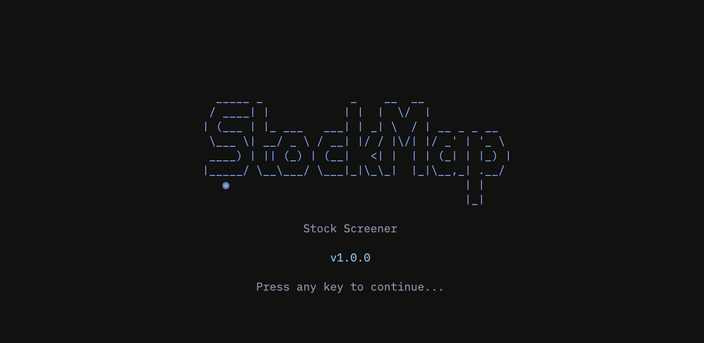

# StockMap: Deep Value Stock Screener for Terminal

<p align="center">
  
</p>

<p align="center">
  <a href="https://github.com/febritecno/stockmap-cli/blob/main/LICENSE"></a>
  <a href="https://go.dev/"></a>
  <a href="https://github.com/charmbracelet/bubbletea"></a>
  <a href="#"></a>
</p>

<p align="center">
  <b>A beautiful, interactive terminal UI stock screener built with Go and the Charm ecosystem.</b><br>
  Find undervalued stocks using technical analysis, valuation metrics, and confluence scoring.
</p>

---

## Features

| Feature | Description |
|---------|-------------|
| **Real-time Data** | Fetches live stock data from Yahoo Finance API |
| **Technical Analysis** | RSI, ATR, SMA/EMA, MACD, Bollinger Bands indicators |
| **Valuation Metrics** | P/B Ratio, P/E Ratio, Graham Number, Book Value |
| **Risk Management** | Dynamic Stop-Loss/Take-Profit based on ATR volatility |
| **Confluence Scoring** | Combined weighted score (Technical + Valuation + Risk) |
| **Price Alerts** | Set alerts for Price, RSI, or % Change with visual notifications |
| **Filter Controls** | Adjust RSI, PBV, and Score thresholds dynamically |
| **Search & Sort** | Quick filter by symbol and sort by any column |
| **Auto-load History** | Automatically loads last scan on startup |
| **Auto-scan** | Starts scanning automatically if no history exists |
| **Help & Legends** | Built-in help with color legends and shortcuts |
| **Responsive UI** | Adapts to different terminal sizes |
| **Interactive TUI** | Navigate with arrow keys or vim-style bindings |
| **Watchlist** | Pin favorite stocks with persistent JSON storage |
| **Scan History** | Browse and reload previous scan results |
| **154+ Stocks** | Default scan covers major US equities across all sectors |

---

## Demo

```
┌──────────────────────────────────────────────────────────────────┐
│  ◉ STOCKMAP v1.0         Market: OPEN      Strategy: Deep Value │
├──────────────────────────────────────────────────────────────────┤
│                                                                  │
│  TICKER │ PRICE   │ TP      │ SL      │ RSI  │ VOL  │ SCORE     │
│  ───────┼─────────┼─────────┼─────────┼──────┼──────┼───────────│
│  * SLV  │ $22.10  │ $24.50  │ $20.80  │ 31.2 │ 18   │ 88 ██████ │
│  * WDC  │ $64.50  │ $72.10  │ $61.20  │ 34.5 │ 22   │ 82 █████  │
│    INTC │ $30.15  │ $35.00  │ $28.50  │ 28.9 │ 15   │ 95 ██████ │
│    VZ   │ $39.80  │ $43.20  │ $38.10  │ 30.1 │ 12   │ 78 █████  │
│                                                                  │
├──────────────────────────────────────────────────────────────────┤
│  [S]can [R]eload [F]ilter [D]etails [W]atch [H]istory [I]nfo [Q] │
│  Scanned: 154 │ Found: 4 │ Updated: 12:34:56                    │
└──────────────────────────────────────────────────────────────────┘
```

---

## Installation

### Quick Install (macOS/Linux)

```bash
curl -sSL https://raw.githubusercontent.com/febritecno/stockmap-cli/main/install.sh | bash
```

### Go Install

```bash
go install github.com/febritecno/stockmap-cli@latest
```

### Build from Source

```bash
# Clone repository
git clone https://github.com/febritecno/stockmap-cli.git
cd stockmap-cli

# Build using Make
make build

# Install using Make (installs to $GOPATH/bin)
make install

# Run
./stockmap
```

### Pre-built Binaries

Download from the [Releases](https://github.com/febritecno/stockmap-cli/releases) page.

## Uninstall

To uninstall StockMap and remove it from your system:

```bash
curl -sL https://raw.githubusercontent.com/febritecno/stockmap-cli/main/uninstall.sh | bash
```

---

## Usage

```bash
# Launch interactive TUI
stockmap

# Show version
stockmap version

# Quick scan
stockmap scan
```

### Startup Behavior

- **With History**: Automatically loads the most recent scan results
- **Without History**: Automatically starts scanning all stocks

---

## Keyboard Shortcuts

### Main Dashboard

| Key | Action |
|-----|--------|
| `S` | Open scan mode selection |
| `R` | Reload/Refresh data (toggle) |
| `T` | Toggle auto-reload (60s interval) |
| `F` | Open filter criteria editor |
| `D` / `Enter` | View stock details |
| `I` | Show help/tutorial/legends |
| `W` | View watchlist |
| `H` | View scan history |
| `P` | View price alerts |
| `A` | Add selected to watchlist |
| `X` | Clear all results |
| `C` | Check connection status |
| `/` | Quick search by symbol |
| `Tab` | Cycle sort column |
| `Shift+Tab` | Toggle sort direction |
| `↑` / `k` | Move up |
| `↓` / `j` | Move down |
| `Esc` | Go back / Clear search |
| `Q` / `Ctrl+C` | Quit |

### Details View

| Key | Action |
|-----|--------|
| `G` | Toggle price chart |
| `A` | Add to watchlist |
| `R` | Remove from watchlist |
| `Esc` | Back to dashboard |

### Watchlist View

| Key | Action |
|-----|--------|
| `A` | Add new symbol |
| `H` | Browse stock categories |
| `R` | Remove selected |
| `D` / `Enter` | View details |
| `Esc` | Back to dashboard |

### Alerts View

| Key | Action |
|-----|--------|
| `N` | Create new alert |
| `D` | Delete selected alert |
| `T` | Toggle alert active/inactive |
| `R` | Reset triggered status |
| `C` | Clear all triggered alerts |
| `Space` | Cycle alert type (in input mode) |
| `Esc` | Back to dashboard |

### Filter View

| Key | Action |
|-----|--------|
| `↑` / `k` | Select previous field |
| `↓` / `j` | Select next field |
| `+` / `=` / `→` | Increase value |
| `-` / `←` | Decrease value |
| `Enter` | Edit value directly |
| `R` | Reset to defaults |
| `Esc` | Apply and go back |

### History View

| Key | Action |
|-----|--------|
| `Enter` | Load selected scan |
| `X` | Delete selected scan |
| `↑` / `k` | Move up |
| `↓` / `j` | Move down |
| `Esc` | Back to dashboard |

### Help View

| Key | Action |
|-----|--------|
| `Esc` / `I` | Close help |

---

## Color Legends

Press `I` to view the built-in help with color legends:

### Confluence Score
| Range | Color | Meaning |
|-------|-------|---------|
| 75-100 | Green | Strong Buy Signal |
| 50-74 | Yellow | Moderate Signal |
| 0-49 | Red | Weak Signal |

### RSI Indicator
| Range | Color | Meaning |
|-------|-------|---------|
| < 30 | Green | Oversold (Buy opportunity) |
| 30-70 | White | Neutral |
| > 70 | Red | Overbought (Sell signal) |

### P/B Value (PBV)
| Range | Color | Meaning |
|-------|-------|---------|
| < 1.0 | Green | Undervalued |
| 1.0-2.0 | White | Fair value |
| > 2.0 | Red | Overvalued |

### Volatility
| Range | Color | Meaning |
|-------|-------|---------|
| < 20% | Green | Low risk |
| 20-40% | White | Moderate risk |
| > 40% | Red | High risk |

### Symbols
| Symbol | Meaning |
|--------|---------|
| `*` | Pinned/Watchlist stock |
| `TP` | Take Profit target price |
| `SL` | Stop Loss price |

---

## Screening Strategy

StockMap uses a **Deep Value** strategy combining multiple factors:

### Technical Indicators
- **RSI < 40** - Oversold/neutral territory preferred
- **Price < SMA20** - Trading below short-term average
- **Risk:Reward >= 1:1.5** - Favorable entry points

### Valuation Metrics
- **P/B Ratio < 2.0** - Trading near or below book value
- **Graham Upside > 0%** - Potential upside to intrinsic value
- **Low P/E Ratio** - Earnings relative to price

### Confluence Score (0-100)

| Component | Weight | Criteria |
|-----------|--------|----------|
| Technical | 30% | RSI, price vs SMA, risk/reward |
| Valuation | 40% | PBV, Graham upside, P/E |
| Risk | 30% | Volatility-adjusted |

**Bonus Points:**
- Both oversold AND undervalued
- PBV < 1.0 (below book value)
- Graham Upside > 50%
- Risk:Reward >= 1:2.5

---

## Configuration

### Watchlist

Default watchlist stored in `config/watchlist.json`:

```json
{
  "symbols": ["SLV", "GDX"]
}
```

Edit this file to customize your pinned stocks.

### Alerts

Alerts are stored in `config/alerts.json`. You can configure:
- **Price Above/Below**: Trigger when price crosses a threshold
- **RSI High/Low**: Trigger on overbought/oversold conditions
- **% Change**: Trigger on significant price movements

### Scan History

Scan results are automatically saved to `config/history/` as JSON files:

```
config/history/
├── scan_20240207_143052.json
├── scan_20240207_120000.json
└── scan_20240206_093015.json
```

**Features:**
- Auto-save after each scan completes
- Auto-load last scan on startup
- Browse history with `[H]` key
- Load any previous scan with `[Enter]`
- Delete old scans with `[X]`

### Color Scheme (Tokyo Night)

| Element | Color |
|---------|-------|
| Background | `#1a1b26` |
| Primary | `#7aa2f7` |
| Success | `#9ece6a` |
| Warning | `#e0af68` |
| Danger | `#f7768e` |
| Cyan | `#7dcfff` |

---

## Architecture

```
stockmap/
├── cmd/
│   └── root.go                 # Cobra CLI entry
├── internal/
│   ├── alerts/
│   │   └── alerts.go           # Price & RSI alert manager
│   ├── analysis/
│   │   ├── indicators.go       # RSI, ATR, SMA, EMA, MACD, Bollinger
│   │   ├── valuation.go        # PBV, Graham Number
│   │   └── risk.go             # SL/TP calculations
│   ├── fetcher/
│   │   ├── yahoo.go            # Yahoo Finance client (library)
│   │   ├── yahoo_direct.go     # Direct API client
│   │   ├── symbols.go          # Categorized stock symbols
│   │   └── pool.go             # Worker pool (10 concurrent)
│   ├── history/
│   │   └── history.go          # Scan history management
│   ├── screener/
│   │   ├── engine.go           # Core screening logic
│   │   └── scoring.go          # Confluence score calculation
│   ├── styles/
│   │   └── styles.go           # Lipgloss styling (Tokyo Night)
│   ├── ui/
│   │   ├── app.go              # Main Bubble Tea model
│   │   ├── views/
│   │   │   ├── dashboard.go    # Main dashboard
│   │   │   ├── scanner.go      # Scan progress view
│   │   │   ├── details.go      # Stock details with chart
│   │   │   ├── watchlist.go    # Watchlist management
│   │   │   ├── history.go      # Scan history browser
│   │   │   ├── alerts.go       # Price alerts view
│   │   │   ├── filter.go       # Filter criteria editor
│   │   │   └── help.go         # Help/legends view
│   │   └── components/
│   │       ├── table.go        # Responsive data table
│   │       ├── header.go       # App header
│   │       └── statusbar.go    # Status bar with keys
│   └── watchlist/
│       └── watchlist.go        # JSON CRUD operations
├── config/
│   ├── history/                # Saved scan results
│   ├── alerts.json             # User alerts
│   └── watchlist.json          # User watchlist
├── main.go
├── go.mod
└── README.md
```

---

## Requirements

- **Go** v1.21 or higher
- **Terminal** with UTF-8 and True Color support
- **Internet** connection for Yahoo Finance API

---

## Dependencies

| Package | Purpose |
|---------|---------|
| [bubbletea](https://github.com/charmbracelet/bubbletea) | TUI framework |
| [lipgloss](https://github.com/charmbracelet/lipgloss) | Terminal styling |
| [finance-go](https://github.com/piquette/finance-go) | Yahoo Finance API |
| [cobra](https://github.com/spf13/cobra) | CLI framework |

---

## Testing

Run the test suite to verify functionality:

```bash
# Run all tests
go test -v ./...

# Run short tests
go test -short ./...

# Run screener tests specifically
go test -v ./internal/screener/...
```

---

## Troubleshooting

### Termux (Android)

If you encounter errors connecting to the Yahoo Finance API on Termux (e.g., certificate errors or "no such host"), try the following:

1. **Run Connection Diagnostics**:
   ```bash
   stockmap debug
   ```
   This will test your connectivity and print detailed error messages.

2. **Install CA Certificates**:
   Termux might be missing root certificates.
   ```bash
   pkg install ca-certificates
   ```

3. **DNS Issues**:
   If you see DNS resolution errors (e.g., `dial tcp: lookup ...: no such host`), try using the new `--dns` flag to force a working resolver (like Google DNS):
   ```bash
   stockmap scan --dns=8.8.8.8
   ```
   
   Or use the `debug` command to test connectivity:
   ```bash
   stockmap debug --dns=8.8.8.8
   ```

## Contributing

Contributions are welcome! Please feel free to submit a Pull Request.

1. Fork the repository
2. Create your feature branch (`git checkout -b feature/amazing-feature`)
3. Commit your changes (`git commit -m 'Add amazing feature'`)
4. Push to the branch (`git push origin feature/amazing-feature`)
5. Open a Pull Request

---

## License

This project is licensed under the MIT License - see the [LICENSE](LICENSE) file for details.

---

## Disclaimer

> **This tool is for educational and informational purposes only.**
>
> It is not financial advice. The screening criteria and confluence scores are based on quantitative metrics and do not guarantee future performance. Always do your own research before making investment decisions.

---

<p align="center">
  Made with Go using <a href="https://github.com/charmbracelet/bubbletea">Bubble Tea</a>
</p>
